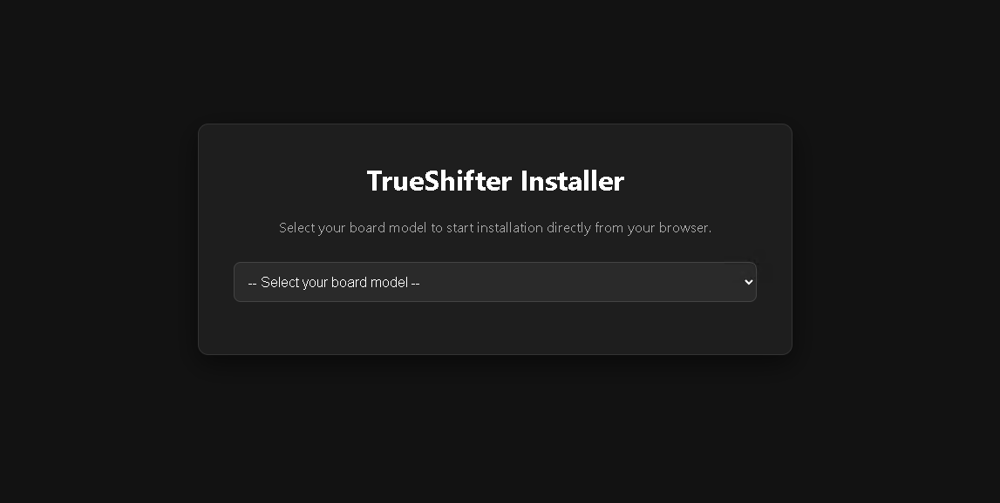
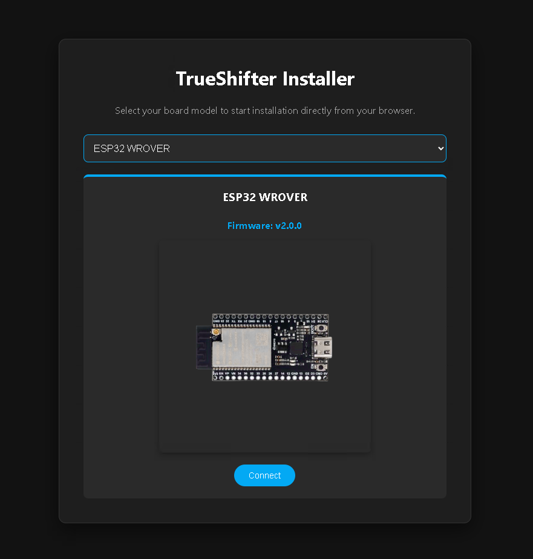
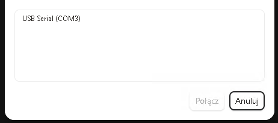
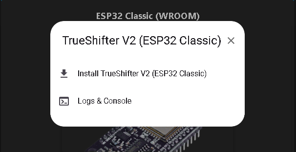
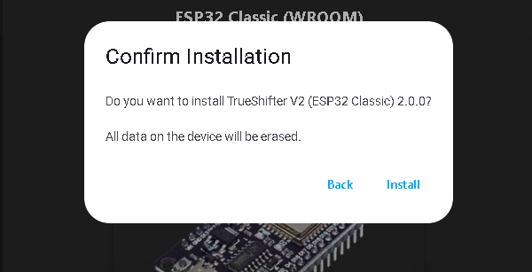
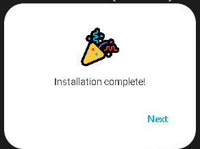

## TrueShifter - Web Installation & Usage Guide

### Overview

TrueShifter is an open-source hardware bridge that translates bHaptics BLE protocols into TrueGear protocols in real time. By utilizing a **single microcontroller** acting concurrently as both a BLE Peripheral and BLE Central, it allows TrueGear haptic vests to be recognized natively as a TactSuit X40.

### Prerequisites

> **Compatible with:**

> * **ESP32 Classic** (WROOM / NodeMCU-32S)
> * **ESP32-C3** (e.g., C3 SuperMini - highly recommended for its compact size)
> * **ESP32-S3**

> **Software:**

> *  Chromium-based browser (**Google Chrome**, **Microsoft Edge**, **Brave**, **Opera**)

> **Web Installer URL:**

> [pawel11223.github.io/TrueShifter](https://pawel11223.github.io/TrueShifter/)

## Step 1 - Board Model Selection

##### **Click the `-- Select your board model --` dropdown menu.**

##### **Pick the specific ESP32 variant matching your hardware.**

#### <mark>Verify that the chosen board matches your target device!</mark>

## Step 2: Connect

##### Click the blue **Connect** button.

##### Select USB serial port from list (e.g., 'USB Serial (Com3) etc.)

> *Troubleshooting: If no device appears, ensure your USB cable supports data lines and verify that you have [CH340 or CP210x drivers installed.
> If not, [Install them.](https://www.youtube.com/watch?v=MM9Fj6bwHLk)

## Step 4: Installation

##### Click *Install TrueShifter V2** to initiate the flashing process.

##### *(The "Logs & Console" option can be used later for serial diagnostics if needed)*.

##### **A confirmation dialog will notify you that the board memory will be wiped before writing.**

##### Click **Install** to start flashing the binary images.

#### <mark>Do not disconnect the board while the installation is running!</mark>

##### Once you see the **Installation complete!** message, click **Next**.

##### Your ESP32 is now programmed with TrueShifter V2 firmware and ready for use.

# First Time Setup

Power on your **TrueGear** haptic vest. 

- Connect your programmed **ESP32** to any 5V USB power source (PC USB port, phone charger, or power bank). 

- The board will automatically connect to your vest over BLE.

- Open bHaptics Player on your PC, or VR headset, your vest will appear natively as a **TactSuit X40**!

#### <mark>If the vest does not connect to TrueShifter, press RST button on the ESP32 board.</mark>

##### Support

If TrueShifter helped you, consider buying me a coffee. Any support is greatly appreciated!

[Buy Me a Coffee](https://buymeacoffee.com/weavr)

